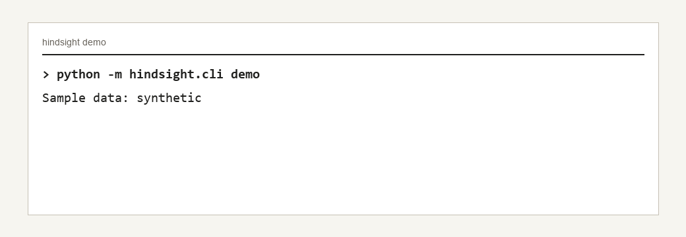

# Hindsight

[](https://github.com/Zwc-11/Hindsight/actions/workflows/ci.yml)

The backtester that catches you lying to yourself.

Leakage-audited, point-in-time, reproducible evaluation for Hyperliquid
microstructure strategies.

Hindsight is a Python backtesting and evaluation harness extracted from
MarketImmune. It focuses on correctness of research evaluation: deterministic
event replay, point-in-time feature access, purged walk-forward folds, leakage
tripwires, execution-cost modeling, and reproducible run manifests.



The capture above is generated from actual `python -m hindsight.cli demo`
output. It uses the bundled synthetic sample data and shows the intended
leakage-audit verdict.

Hindsight is an evaluation harness, not an execution-research simulator. Fill
model: market orders fill as takers at the touch when top-of-book is available
with linear impact slippage; the kline-close fallback is flagged
`top_of_book_missing`. Limit orders fill as makers at the limit price only when
a trade prints through it, capped at `participation_cap * print_size`. There is
no queue-position model. Orders activate after `latency_ms`. Funding accrues
every `funding_interval_hours` at a flat configured rate, not a historical
funding series. Fee bps are configurable; the default smoke config uses
Hyperliquid's published base perps tier of 1.5 bps maker and 4.5 bps taker, but
real accounts can have tier discounts or maker rebates. No live trading. Bundled
data labels live in
[examples/sample_data/data_manifest.json](examples/sample_data/data_manifest.json).

## Quick Start

```powershell
python -m pip install -e ".[dev]"
python -m pytest
python -m hindsight.cli demo
python -m hindsight.cli run
python -m hindsight.cli benchmark
```

On PowerShell, the same starter demo is:

```powershell
.\make.ps1 install
.\make.ps1 demo
```

After installation, the console entry point is also available:

```powershell
hindsight run
hindsight benchmark
hindsight demo
```

The default commands use tiny synthetic sample lakes under
`examples/sample_data/` and write generated reports under `reports/`.

The flagship demo writes a JSON report, Markdown report, manifest, and two
leaderboards. It first runs a deliberately unsafe random-split control where the
leaky policy wins, then runs Hindsight's audit path and blocks that same leaky
policy.

Committed demo artifacts live in [examples/runs/demo](examples/runs/demo):

- [demo.md](examples/runs/demo/demo.md)
- [demo.json](examples/runs/demo/demo.json)
- [manifest.json](examples/runs/demo/manifest.json)

## What Is Included

- `hindsight.core`: canonical event schemas, replay clock, stable hashing.
- `hindsight.pit`: point-in-time data access with lookahead guards.
- `hindsight.evaluation`: purged walk-forward validation, leakage probes,
  markout metrics, deflated Sharpe, and probability of backtest overfit.
- `hindsight.execution`: costed replay simulator with fees, slippage, latency,
  funding, and participation caps.
- `hindsight.strategy.baselines`: simple clean and intentionally leaky baselines.
- `hindsight.reporting`: JSON, Markdown, leaderboard, manifest, and curve output.
- `hindsight.data`: standalone parquet readers for the bundled samples and
  Hyperliquid markout lake layout.

## Reproduce

This standalone repo has no `marketimmune` imports and the Hindsight test suite
runs offline:

```powershell
python -m pytest tests/hindsight -q
```

The bundled sample data is synthetic and exists only to make smoke tests and
demo commands reproducible. Use your own Hyperliquid lake for real benchmark
claims.

## Determinism

Every run manifest includes:

- `engine_version`
- `git_sha`
- `data_content_hash`
- `config_hash`
- `seed`
- `run_id`

The committed demo manifest uses the Hyperliquid synthetic sample hash from
`examples/sample_data/data_manifest.json`. CI runs the demo twice and checks that
the two fresh manifests agree on `run_id` and `data_content_hash`.

## Benchmark Provenance

Benchmark numbers are only valid when linked to committed artifacts. Synthetic
demo artifacts live in [examples/runs/demo](examples/runs/demo). Real or licensed
benchmark artifacts belong in [docs/benchmarks](docs/benchmarks) and must record
the producing command.

The current real-data proof artifact is a local Hyperliquid SOL run:
[docs/benchmarks/2026-07-02-local-hyperliquid-sol-20260527](docs/benchmarks/2026-07-02-local-hyperliquid-sol-20260527).
It commits benchmark output and source-file hashes only; raw market data is not
redistributed.

## Related Work

| Tool | Focus | Fill Realism | Venues | ML Evaluation Features | Verdict |
| --- | --- | --- | --- | --- | --- |
| Hindsight | Leakage-audited ML evaluation | Disclosed simple fills | Hyperliquid workflows | PIT access, purged folds, leakage probes, DSR/PBO, manifests | Use for research integrity |
| hftbacktest | High-fidelity execution simulation | Stronger queue/latency modeling | Binance/Bybit-style feeds | Not centered on ML leakage auditing | Use for execution realism |

## Development Gates

```powershell
python -m ruff check .
python -m mypy
python -m coverage run -m pytest tests/hindsight -q
python -m coverage report
python -m hindsight.cli demo
```

## Docs

- [Data](docs/data.md)
- [Limitations](docs/limitations.md)
- [Related Work](docs/related_work.md)
- [Benchmarks](docs/benchmarks/README.md)
